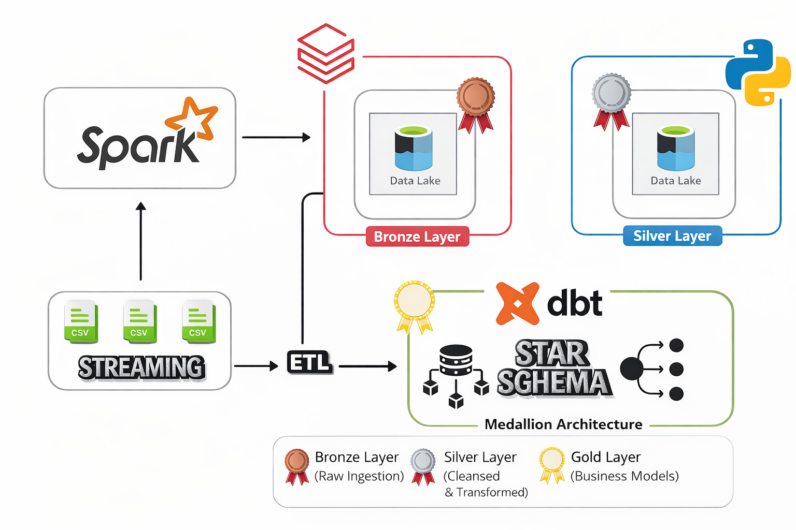

# End-to-End Data Engineering Pipeline (PySpark Streaming + dbt Cloud)
)
##  Project Overview

This project demonstrates an **industry-level data engineering pipeline** built using:

* ⚡ **PySpark Structured Streaming**
* 🧱 **Delta Lake**
* 🔄 **dbt Cloud**
* ☁️ **Databricks**
* 🐙 **GitHub (Version Control)**

The pipeline follows the **Medallion Architecture (Bronze → Silver → Gold)** and implements **modular, scalable, and production-ready data transformations**.

---

##  Architecture

### 🥉 Bronze Layer (Raw Ingestion)

* Source data is ingested using **PySpark Structured Streaming**
* Data is stored in **Delta format**
* Schema is inferred initially and enforced for streaming
* Handles raw ingestion with minimal transformation

---

### 🥈 Silver Layer (Cleansed & Transformed)

* Implements:

  * ✅ **Deduplication using Window functions**
  * ✅ **Dynamic transformations (modular functions)**
  * ✅ **Upsert (Merge) logic using Delta Lake**
  * ✅ **SCD Type 2 handling for historical tracking**

* Ensures:

  * Clean, consistent, and enriched data
  * Handles late-arriving and updated records

---

### 🥇 Gold Layer (Business Layer - dbt)

* Built using **dbt Cloud models**

* Implements:

  * 📊 Aggregations (e.g., revenue per city)
  * 🔗 Joins with dimension tables
  * 📈 Analytical models for reporting

* Uses:

  * `ref()` for dependency management
  * Incremental models for performance optimization

---

## ⚙️ Key Features

### 🔁 Incremental Processing

* Only new/updated records are processed
* Uses `last_updated_timestamp` for filtering

---

### 🔄 Upsert (Merge Logic)

* Combines:

  * **Insert (new records)**
  * **Update (existing records based on timestamp)**

---

### 🧠 SCD Type 2 (Slowly Changing Dimension)

* Tracks historical changes in dimension tables
* Maintains:

  * Active records
  * Historical versions

---

### 🧩 Modular Code Design

* Reusable transformation functions:

  * `dedup()` → removes duplicates
  * `upsert()` → handles merge logic
* Clean separation of logic across layers

---

### 📡 Streaming + Batch Hybrid

* Uses:

  * `trigger(once=True)` for batch-like streaming
* Ensures:

  * Reliability
  * Scalability

---

## 📂 Project Structure

```
📦 project-root
 ┣ 📂 pyspark_dbt_project
 ┃ ┣ 📜 utils
 ┃ ┣ 📜 silver-transformations
 ┃ ┗ 📜 Bronze-ingestion
 ┣ 📂 dbt
 ┃ ┣ 📂 models
 ┃ ┃ ┣ 📂 staging
 ┃ ┃ ┣ 📂 marts
 ┃ ┃ ┗ 📜 schema.yml
 ┃ ┣ 📜 dbt_project.yml
 ┃ ┗ 📜 profiles.yml
 ┣ 📜 README.md
```

---

## 🔧 Technologies Used

| Tool       | Purpose                        |
| ---------- | ------------------------------ |
| PySpark    | Data processing & streaming    |
| Delta Lake | Storage & ACID transactions    |
| Databricks | Execution environment          |
| dbt Cloud  | Data transformation & modeling |
| GitHub     | Version control                |

---

## ▶️ How to Run

### 🔹 PySpark Pipeline

1. Upload data to source path
2. Run streaming job:

```python
df.writeStream \
  .format("delta") \
  .option("checkpointLocation", "/checkpoints/") \
  .toTable("bronze.table_name")
```

---

### 🔹 dbt Models

Run:

```bash
dbt run
```

For incremental models:

```bash
dbt run --models model_name
```

---

## 🔍 Data Flow

```
Source Data
    ↓
Bronze Layer (Raw - Streaming)
    ↓
Silver Layer (Cleaned - Dedup + Upsert + SCD2)
    ↓
Gold Layer (dbt Models - Analytics)
```

---

## 🧪 Key Concepts Demonstrated

* Structured Streaming
* Delta Lake Merge (Upsert)
* Window Functions (Deduplication)
* Incremental Data Processing
* SCD Type 2 Implementation
* dbt Modeling (ref, incremental, sources)
* Medallion Architecture

---

## 🚀 Future Improvements

* Add data quality checks (dbt tests)
* Implement orchestration (Airflow)
* Add monitoring & logging
* Optimize partitioning strategies

---

## 👨‍💻 Author

**Hussain Ali**


